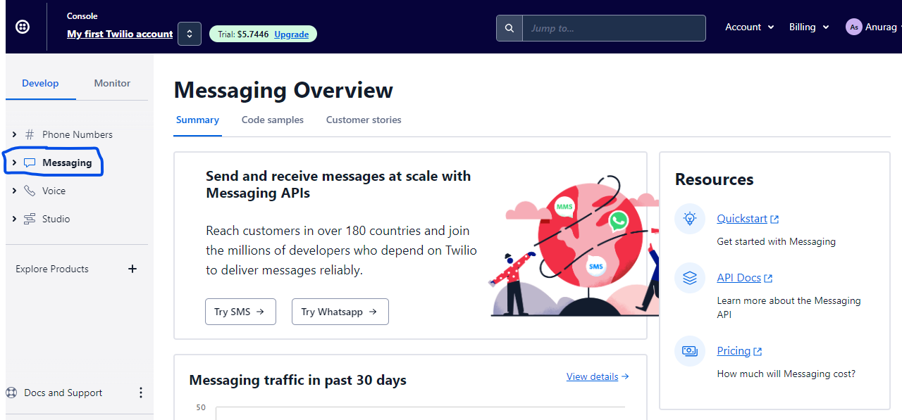
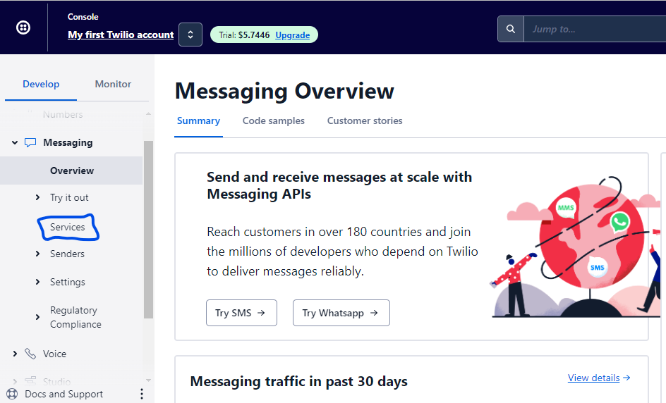
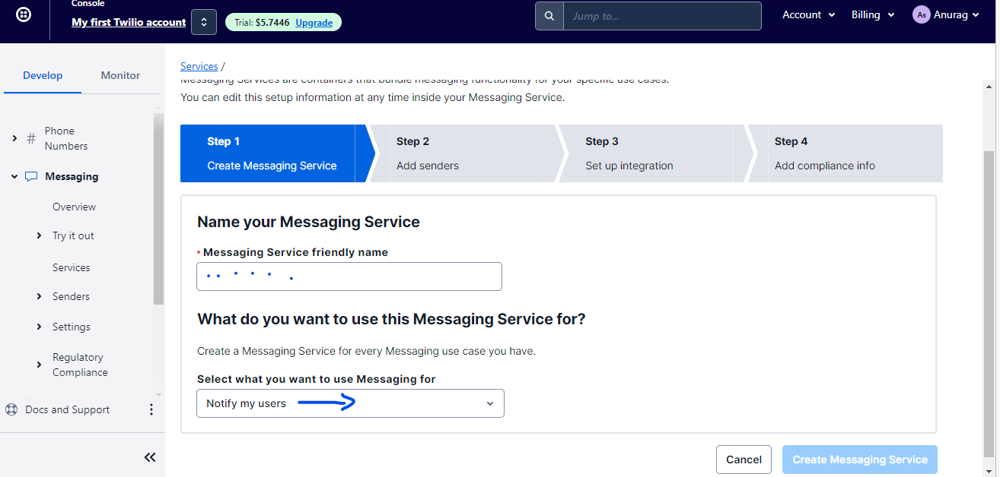
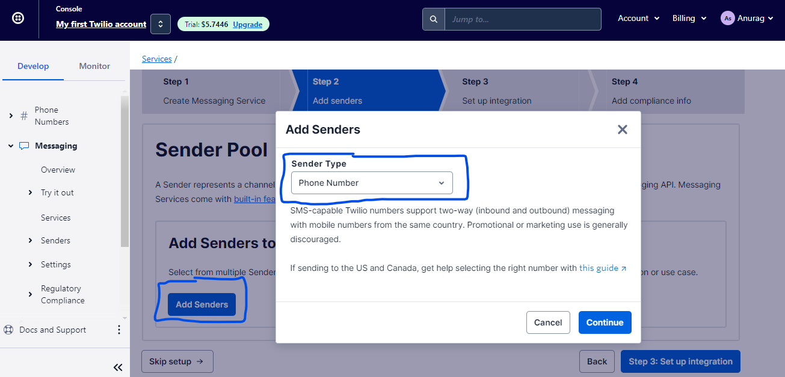
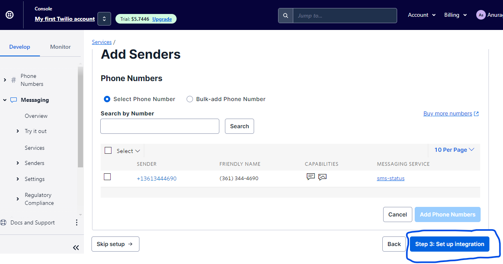
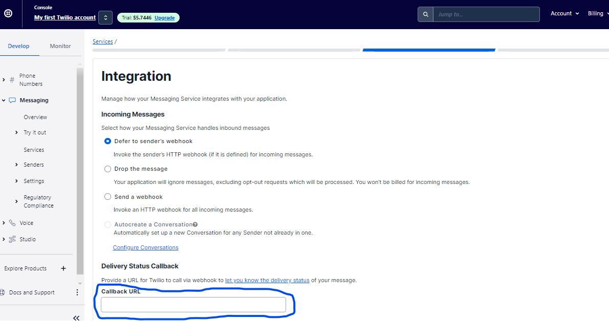
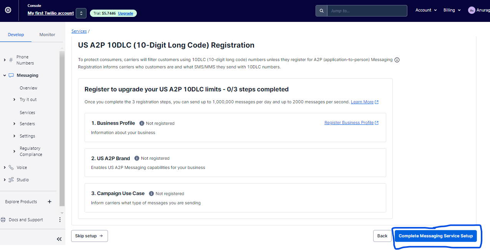
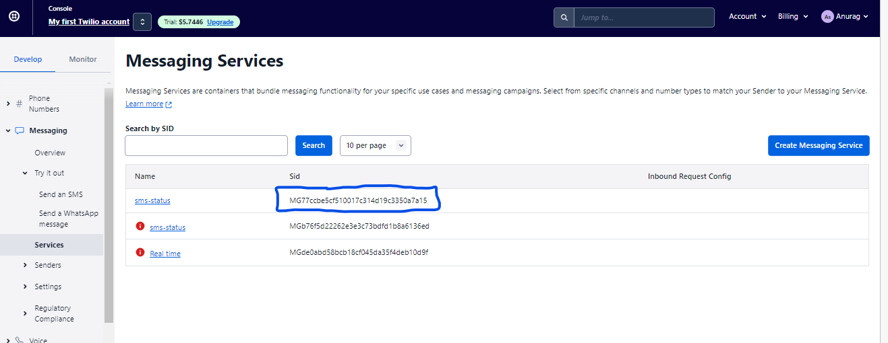

### Configure Twilio status callback

```
Click on "Messaging" in left side nevigation section.
```


```
Scroll down the Messaging dropdown and select services.
```


```
Now click on create messaging service
```


```
Give a unique name for this message service, and also select what type of message you want to send from the dropdown. And then click on create messaging service.
```


```
Select add sender and inside this tab another tab will open there we have to select sender type from the dropdown.
```


```
Then click on setup for integration.
```


```
Inside integration tab, scroll down to the delivery status callback. And put the webhook URL which we have created inside callback url field and click on add compliance info.
```


```
Now click on "Complete Messaging Service setup"
```


#### NOTE:-
```
When we send normal sms useing any code we have to give from no or sender no but when we use any message service of Twilio there we have to put its sid.
```
 